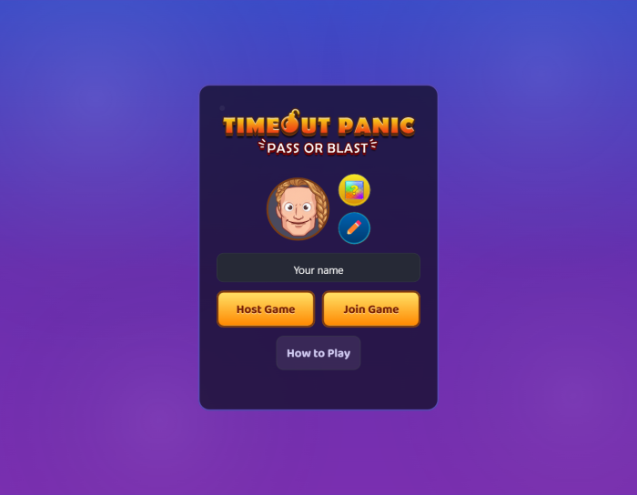
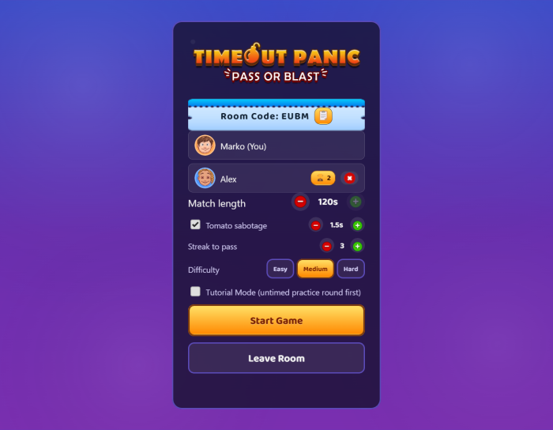
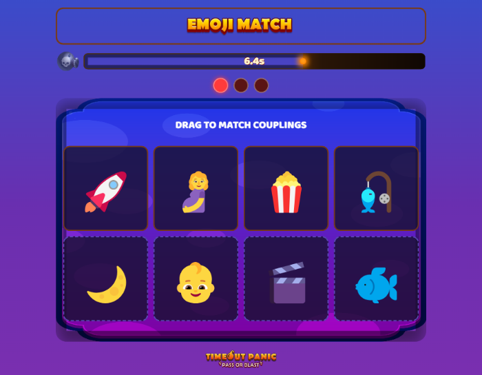

# 💣 Timeout Panic — Pass or Blast

A free browser party game for 2–8 players. Pass the bomb around the group by solving quick
mini-games before your fuse runs out — whoever's holding it when the timer hits zero loses.

No app to install, no account, no server costs: one player hosts, everyone else joins with a
4-letter code, and the whole match runs peer-to-peer in the browser.

<p align="center">
  
  
  
</p>

## How to play

1. **One player hosts.** Open the game, enter a name, hit **Host Game**. You'll get a 4-letter
   room code and a lobby where you can tweak the match settings (see below).
2. **Everyone else joins.** Enter the same name field, hit **Join Game**, and type in the host's
   room code.
3. **Host hits Start Game.** The bomb lands on a random player and the match begins.
4. **Whoever's holding the bomb solves puzzles** — same mini-game, over and over, until they land
   enough correct answers in a row (the *streak*) to pass the bomb to the next player.
5. **Everyone else watches and sabotages.** While you're not holding the bomb, earn tomatoes for
   your basket (solve a side puzzle, or buy them) and throw them at the current holder whenever
   you want, or spend points in the Shop.
6. **Last player standing wins.**

## The rules

- **Two timers.** Your **personal fuse** (10s by default) only runs while *you're* holding the
  bomb — let it hit zero and you're eliminated. The **match clock** (host-configurable, 30–120s)
  runs for the whole game — whoever's holding the bomb when *it* hits zero loses instead, even if
  their own fuse still had time left.
- **Pass the bomb by streaking.** Land a set number of correct answers in a row (**3** by default,
  host can set 1–4) on the *same* mini-game type, and the bomb moves to the next player — your
  fuse resets fresh for them.
- **A wrong answer isn't fatal.** It just resets your streak back to 0. Your fuse keeps ticking
  either way, so don't freeze up — a miss only costs you progress, not time.
- **Tomato sabotage** (optional, on by default). While you're waiting for your turn, tap **Earn
  Tomato** for a quick puzzle — randomly either **Snake** (trace a path connecting checkpoints 1→6
  while covering every tile) or **Tomato Rush** (time a swinging claw to grab a tomato before it
  hits a bomb) — to earn one tomato for your basket (once per turn). Tomatoes aren't thrown
  automatically: throw as many as you've got, whenever you want, at the current holder — no
  puzzle or turn limit on the *throwing* itself. A hit splats their screen for a moment (1–3s,
  host-configurable) while their fuse keeps burning.
- **Points & the Shop.** Earning a tomato, or finishing a streak fast as the holder, earns you
  points. Spend them (while you're *not* holding the bomb) on:
  - **+5s Fuse Time** — extra time for your *next* turn as holder
  - **+1 Tomato** — buy one for your basket, no puzzle required
  - **Anti-Tomato Shield** — blocks the next 5 tomatoes thrown at you for the rest of the round
  - **Skip-Ahead Pass** — the bomb jumps straight over you next time it's your turn
- **Last one standing wins.** Get eliminated (fuse *or* match clock runs out on you) and you're
  out for the rest of that round.

## The mini-games

The bomb holder is handed one of these at random each turn (never the same one twice in a row):

| Game | What you do |
|---|---|
| **Stroop** | Tap the color swatch that matches — the prompt tells you whether to match the *word* or the *color it's printed in*. |
| **Swipe** | Swipe the zone in the shown direction — watch for "DON'T" or "OPPOSITE" twists. |
| **Whack-a-Mole** | Tap the bomb icon before it disappears back into its hole. |
| **Emoji Match** | Drag each card onto its matching emoji, from either row, until the whole board is cleared. |
| **Reflex Runner** | Tap STOP the instant the moving marker is inside the green zone. |
| **Wire Cut** | Read the rule, then tap the one wire it describes — by color, position, or next to another wire. |
| **Pipe Connect** | Tap tiles to rotate them and connect a pipe from the left inlet all the way to the right outlet. |

The host can toggle any of these on/off, tune each one's settings (colors, grid size, speed,
pairs per round, ...), and set a match-wide difficulty (Easy/Medium/Hard) from the lobby.

New to the game? Turn on **Tutorial Mode** in the lobby before starting — every player gets one
untimed practice round through each enabled mini-game first, with an on-screen explanation, before
the real match begins.

## Running it locally

```bash
npm install
npm run dev
```

Open the printed local URL, then open it again in a second tab (or another device on the same
network) to test host + client together.

**Tech stack:** [Phaser 3](https://phaser.io/) for the spectator board, [PeerJS](https://peerjs.com/)
(WebRTC) for host↔client networking, [Vite](https://vitejs.dev/) for the build — no backend
server, no database, $0 infrastructure. The room's host machine runs the authoritative game loop;
everyone else just sends input and renders whatever state the host broadcasts.

### Modding

`npm run mod-tool` starts a local admin UI (separate from the game itself) for tuning match
settings, adding new mini-games from a working template, managing avatar art and sounds, and
auto-generating title banner art for any mini-game in the game's own visual style. See
[`tools/mod-tool/README.md`](tools/mod-tool/README.md) for details.
